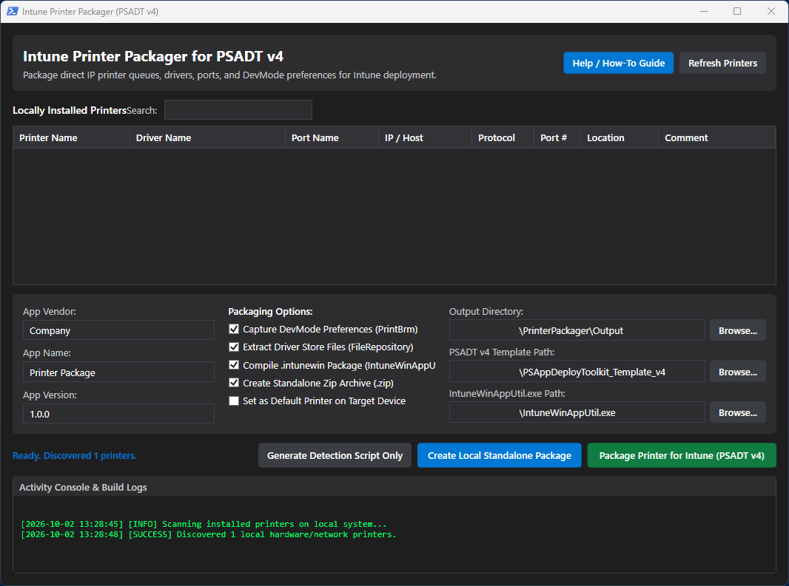

# Intune Printer Packager for PSADT v4

A modern WPF PowerShell application designed to discover locally installed network and direct IP printers, extract their drivers and preferences, and automatically package them for enterprise deployment via **Microsoft Intune (Win32 App)** or **Standalone Local Installation** using **PSAppDeployToolkit v4 (PSADT v4)**.

<p align="center">
  
</p>

---

## Features

- **WPF Dark Mode Graphical Interface**: Clean, responsive UI to inspect, filter, and select installed hardware/network printers.
- **Printer & Port Discovery**: Auto-detects printer queues, drivers, ports, IP addresses, protocols (RAW 9100 / LPR 515), comments, and locations.
- **Full DriverStore Extraction**: Automatically copies complete driver packages (`.inf`, `.cat`, `.sys`, `.dll`, `.gpd`, etc.) directly from `C:\Windows\System32\DriverStore\FileRepository` so target devices require no network share or internet access to install drivers.
- **Dual Preference & DevMode Capture**:
  - **`PrintBrm`**: Captures binary queue configurations, spooler preferences, and default orientation.
  - **`PrintUI.dll` (`/Ss` and `/Sr`)**: Backs up and restores full vendor-specific driver DevMode data (trays, duplex defaults, color/monochrome settings, finishing options).
- **Pure PowerShell Execution**: No legacy `cscript`, VBScript, or batch dependencies.
- **PSADT v4 Standardized Deployment**: Injects full pre-flight, install, and uninstall logic into `Invoke-AppDeployToolkit.ps1` with 64-bit and 32-bit (`Sysnative`) file system redirection safety.
- **Automated IntuneWin Packaging**: Compiles packages into `.intunewin` files named dynamically after your printer with zero cross-package collisions.
- **Standalone Local Installers**: Generates self-elevating `Install-PrinterLocal.cmd` and `Uninstall-PrinterLocal.cmd` scripts for easy manual deployment, testing, or non-Intune management tools.
- **Distribution Zip Archive**: Optionally bundles the complete PSADT package and standalone launchers into a clean `.zip` file for distribution.
- **Intune Custom Detection Script**: Auto-generates `Detection.ps1` verifying both printer queue and port existence for 100% reliable Intune detection rules.
- **In-App Interactive Guide**: Built-in "Help / How-To Guide" window with step-by-step instructions and toolkit links.
- **Included Manufacturer Logos**: Pre-sized 230×230 PNG logos in `assets/logos/` ready to upload as icons in Microsoft Intune Admin Center.

---

## Prerequisites

Before running the packager, ensure your environment meets the following requirements:

1. **Operating System**: Windows 10, Windows 11, or Windows Server.
2. **Permissions**: Local Administrator privileges (required to query the DriverStore and run PrintBrm).
3. **PowerShell**: PowerShell 5.1 or PowerShell 7+ (launches automatically in STA mode for WPF).
4. **PSAppDeployToolkit (PSADT v4)**:
   - **Tested & Developed with**: **[PSADT v4.1.8](https://github.com/PSAppDeployToolkit/PSAppDeployToolkit/releases/tag/4.1.8)**
   - Download the release archive from the official [PSAppDeployToolkit v4.1.8 Release](https://github.com/PSAppDeployToolkit/PSAppDeployToolkit/releases/tag/4.1.8) (or visit [psappdeploytoolkit.com](https://psappdeploytoolkit.com)).
   - Extract the toolkit and name the template folder `PSAppDeployToolkit_Template_v4` adjacent to this script, in the script directory, or select it via the in-app **Browse...** button.
5. **Microsoft Win32 Content Prep Tool (`IntuneWinAppUtil.exe`)**:
   - **Tested & Developed with**: **[IntuneWinAppUtil v1.8.7](https://github.com/microsoft/Microsoft-Win32-Content-Prep-Tool/releases/tag/v1.8.7)**
   - Download `IntuneWinAppUtil.exe` directly from the official [Microsoft Win32 Content Prep Tool v1.8.7 Release](https://github.com/microsoft/Microsoft-Win32-Content-Prep-Tool/releases/tag/v1.8.7).
   - Place it adjacent to this script, in the script directory, add it to your system `PATH`, or select it via the in-app **Browse...** button.

---

## Quick Start

1. Open PowerShell as Administrator.
2. Clone or download this repository:
   ```powershell
   git clone https://github.com/william-scholes/Intune-PrinterPackager-PSADT.git
   cd Intune-PrinterPackager-PSADT
   ```
3. Run the packager application:
   ```powershell
   & ".\Start-PrinterPackager.ps1"
   ```
4. Configure your toolkit paths if they are not automatically detected (using the **Browse...** buttons for the PSADT template and `IntuneWinAppUtil.exe`).
5. Select a printer from the grid.
6. Customize your **App Vendor**, **App Name**, and **App Version**.
7. Choose your desired packaging options:
   - `Capture DevMode Preferences (PrintBrm & PrintUI)`
   - `Extract Driver Store Files (FileRepository)`
   - `Compile .intunewin Package (IntuneWinAppUtil)`
   - `Create Standalone Zip Archive (.zip)`
   - `Set as Default Printer on Target Device`
8. Click **Package Printer for Intune (PSADT v4)** or **Create Local Standalone Package**.

---

## Deployment Options

### Option A: Deployment via Microsoft Intune (Win32 App)

1. Sign in to the [Microsoft Intune Admin Center](https://intune.microsoft.com).
2. Navigate to **Apps** > **Windows** > **Add** > **Windows app (Win32)**.
3. Click **Select app package file** and upload your generated `.intunewin` file from the `Output\` folder.
4. **App Information**:
   - **Name**: `Company - Printer - <PrinterName>`
   - **Description**: Provide a description of the printer and location.
   - **Publisher**: Your organization or printer manufacturer.
   - **Logo**: Choose the appropriate manufacturer logo from the [`assets/logos/`](assets/logos/) folder.
5. **Program Settings**:
   - **Install command**:  
     `powershell.exe -ExecutionPolicy Bypass -WindowStyle Hidden -File "Invoke-AppDeployToolkit.ps1" -DeploymentType Install -DeployMode Silent`  
     *(or: `Invoke-AppDeployToolkit.exe -DeploymentType Install -DeployMode Silent`)*
   - **Uninstall command**:  
     `powershell.exe -ExecutionPolicy Bypass -WindowStyle Hidden -File "Invoke-AppDeployToolkit.ps1" -DeploymentType Uninstall -DeployMode Silent`  
     *(or: `Invoke-AppDeployToolkit.exe -DeploymentType Uninstall -DeployMode Silent`)*
   - **Install behavior**: `System`
   - **Device restart behavior**: `No specific action`
6. **Requirements**:
   - **Operating system architecture**: `64-bit` (and `32-bit` if applicable).
   - **Minimum operating system**: `Windows 10 1607` or higher.
7. **Detection Rules**:
   - **Rules format**: `Use a custom detection script`
   - **Script file**: Upload the generated `Detection.ps1` from the package folder.
   - **Run script as 32-bit process on 64-bit clients**: `No`
   - **Enforce script signature check**: `No`
8. **Assignments**: Assign to device or user groups as **Required** or **Available**.

---

### Option B: Local Standalone Deployment (No Intune Required)

1. Copy the generated package folder or `.zip` archive (from the `Output\` folder) to the destination workstation.
2. Extract the archive if zipped.
3. **To Install**: Right-click `Install-PrinterLocal.cmd` and select **Run as Administrator** (or double-click to self-elevate).
4. **To Uninstall**: Right-click `Uninstall-PrinterLocal.cmd` and select **Run as Administrator** (or double-click to self-elevate).
5. Progress is displayed in an interactive console window, and comprehensive logs are written to `C:\Windows\Logs\Software\`.

---

## Repository Structure

```text
Intune-PrinterPackager-PSADT/
├── Start-PrinterPackager.ps1   # Main WPF GUI application
├── README.md                   # Documentation and usage guide
├── .gitignore                  # Git ignore rules for build artifacts
└── assets/
    ├── WPF_GUI.png             # Application interface screenshot
    └── logos/                  # 230x230 PNG printer logos for Intune
        ├── Brother-230x230.png
        ├── canon-230x84.png
        ├── Epson-230x129.png
        ├── HP-230x230.png
        ├── Intermec-230x72.png
        ├── KinicaMinolta-230x133.png
        ├── Kyocera-230x284.png
        ├── oce-230x230.png
        ├── printer-230x207.png
        ├── Ricoh-230x48.png
        ├── Xerox2-230x230.png
        └── Zebra-230x242.png
```

### Generated Output Package Structure

```text
Output/
├── Company - Printer - Office-Auckland - 1.0.0.intunewin  # Intune Win32 package
├── Company - Printer - Office-Auckland - 1.0.0.zip        # Standalone zip archive
└── Company - Printer - Office-Auckland - 1.0.0/           # Complete PSADT v4 package
    ├── Files/
    │   ├── Drivers/                # Extracted driver INF & binary files
    │   ├── printer.printerExport   # PrintBrm configuration backup
    │   ├── printer_settings.dat    # PrintUI.dll binary preferences backup
    │   └── printer_config.json     # Metadata & deployment settings
    ├── Install-PrinterLocal.cmd    # Self-elevating local installer launcher
    ├── Install-PrinterLocal.ps1    # Interactive local install script
    ├── Uninstall-PrinterLocal.cmd  # Self-elevating local uninstaller launcher
    ├── Uninstall-PrinterLocal.ps1  # Interactive local uninstall script
    ├── Invoke-AppDeployToolkit.exe # Executable deployment runner
    ├── Invoke-AppDeployToolkit.ps1 # PSADT v4 deployment script
    ├── Detection.ps1               # Intune detection rule script
    └── PSAppDeployToolkit/         # Core PSADT engine files
```

---

## Troubleshooting & Log Locations

When troubleshooting installation failures or verifying deployment steps on client endpoints, review the following log locations:

### 1. PSADT Deployment Logs (Toolkit & Driver Execution)
- **Directory**: `C:\Windows\Logs\Software\`
- **Filename**: `<AppVendor>_<AppName>_<AppVersion>_<AppLang>_<AppRevision>_PSAppDeployToolkit_Install.log`  
  *(e.g., `Company_Printer-Office-Auckland_1.0.0_EN_01_PSAppDeployToolkit_Install.log`)*
- **What to look for**:
  - Full trace of driver staging via `pnputil.exe`.
  - TCP/IP printer port creation (`RAW 9100` or `LPR`).
  - Preference restore steps via `PrintBrm` and `PrintUI.dll`.
  - Detailed error records and script line numbers if a command fails (e.g. exit code `60001`).
- *Note*: If executed interactively in user context (outside of `SYSTEM`), logs may be written to `%TEMP%` (`C:\Users\<Username>\AppData\Local\Temp\`).

### 2. Intune Management Extension (IME) Logs
- **Directory**: `C:\ProgramData\Microsoft\IntuneManagementExtension\Logs\`
- **Key Log Files**:
  - **`IntuneManagementExtension.log`**: Tracks policy sync, content download, package staging into `C:\Windows\IMECache`, process execution, and exit code evaluation.  
    *(Tip: Use CMTrace or OneTrace and filter by `[Win32App]` or your printer's name).*
  - **`AgentExecutor.log`**: Captures execution and exit code output of PowerShell detection rules (`Detection.ps1`).

### Quick Diagnostic Reference

| Symptom / Exit Code | Cause | Resolution |
| :--- | :--- | :--- |
| **Exit Code `60001`** | An unhandled PowerShell terminating error occurred during the PSADT deployment block. | Open the install log in `C:\Windows\Logs\Software\` and inspect the stack trace immediately preceding `exit code [60001]`. |
| **Exit Code `0` but Intune reports "Not Detected"** | Installation completed successfully, but the detection rule script returned exit code `1`. | Open `AgentExecutor.log`. Ensure the printer queue name and port name created on the client match the strings in `Detection.ps1` exactly. |
| **"The file [pnputil.exe] was unable to be found"** | WOW64 file system redirection caused a 32-bit PowerShell process to look in `SysWOW64` instead of `System32`. | Ensure you are using the latest version of this packager; it automatically resolves `pnputil.exe` and `PrintBrm.exe` via `$env:SystemRoot\Sysnative`. |
| **AppLocker / WDAC Execution Blocks** | Endpoint application control policies blocked `Invoke-AppDeployToolkit.exe`. | In Intune Program Settings, use `powershell.exe -ExecutionPolicy Bypass -WindowStyle Hidden -File "Invoke-AppDeployToolkit.ps1"` instead of calling the `.exe` wrapper. |
| **Pre-Deployment Local Testing** | Need to verify driver compatibility and settings before packaging into `.intunewin`. | Extract the generated standalone `.zip` on a test computer and run `Install-PrinterLocal.cmd` as Administrator to review live console feedback. |

---

## Known Limitations

- **Custom Label Printer Paper Sizes / Stocks (e.g., Zebra, Intermec)**:
  - Custom user-defined stocks and label dimensions (such as custom `104.00mm × 175.00mm` dimensions) are stored at the Windows Print Server level as system-wide **Print Forms** rather than inside the driver-specific preference file.
  - While global driver preferences, darkness, and print speed are correctly captured and restored via `PrintUI.dll`, custom label paper size definitions must be pre-configured on target clients (e.g., via a Print Server form deployment or Zebra Setup Utilities script) or the driver may fall back to default stock dimensions (e.g., `76.20mm × 50.80mm`).

---

## Contributing & Issues

Contributions, suggestions, and bug reports are welcome! Please open an issue or pull request on the [GitHub repository](https://github.com/william-scholes/Intune-PrinterPackager-PSADT).

---

## License

This project is licensed under the [MIT License](https://opensource.org/licenses/MIT). You are free to use, modify, and distribute this software for personal and commercial purposes.
